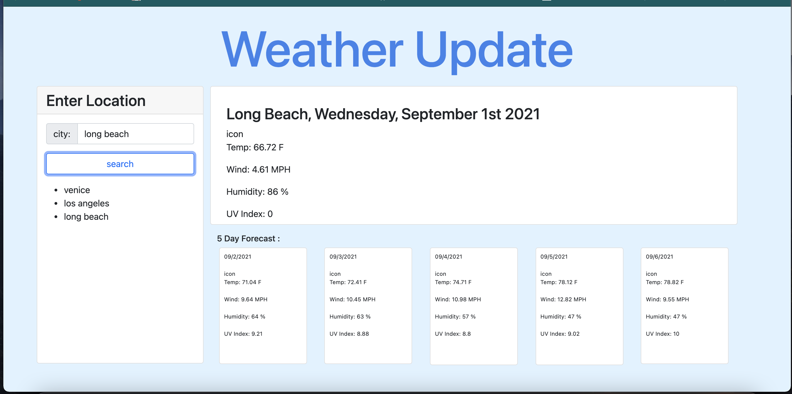

## Project Name : weather-outlook
 
 

## Link to the working site
 

    - https://kasdjono.github.io/weather-outlook/
 

## This program will show the weather for a selected city
 
 

## The following features have been added to the page:
 

        - A weather dashboard with form inputs is first displayed
        - When a city is entered the user is presented with current and future conditions for that city and *that city is added to the search history*
        - The user is presented with the city name, the date, an *icon representation of weather conditions*, the temperature, the humidity, the wind speed, and the UV index
        - The user is presented with a 5 day forecast which includes, *the date*, an *icon representation of weather conditions*, the temperature, the humidity, the wind speed, and the UV index
        - WHEN a resent city search is clicked, the user is presented with current and future conditions for that city

 

## Screen Shots of App
 

        - The following pictures were taken before the proper questions were written

 